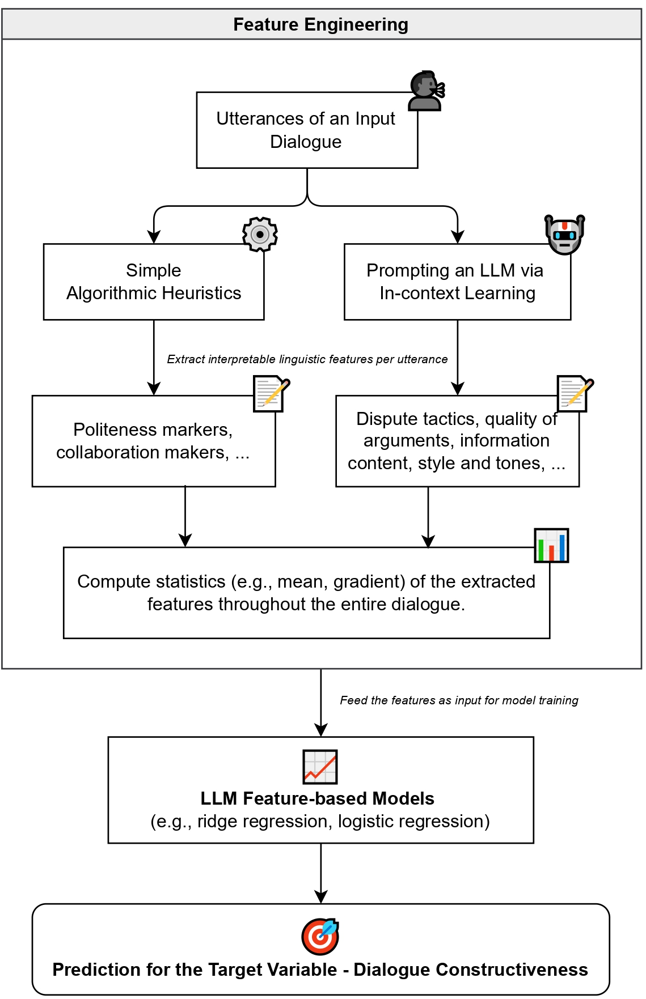

# An LLM Feature-based Framework for Dialogue Constructiveness Assessment
This repository bundles the code associated with the paper: [An LLM Feature-based Franework for Dialogue Constructiveness Assessment](https://arxiv.org/pdf/2406.14760).

## Paper Overview

Our LLM feature-based framework for dialogue constructiveness assessment intergrates the strengths of feature-based and neural approaches while mitigating their downsides, serving as a valuable toolkit that enables researchers to develop more accurate, robust, and interpretable models for assessing dialogue constructiveness. The framework operates as follows:
1. **Feature Engineering**: The system extracts a rich array of dataset-independent and interpretable linguistic features from dialogue utterances using both algorithmic heuristics and prompting an LLM via in-context learning.
2. **Feature Processing**: Statistics (e.g., mean, gradient) are computed for the extracted features throughout the entire dialogue.
3. **Model Training**: The processed statistics/features are used to train interpretable LLM feature-based models (e.g., ridge/logistic regression) for predicting dialogue constructiveness.

<p align="center">
  
  <br>
  <em>Figure 1: Flowchart delineating a high-level overview of our proposed framework for dialogue constructiveness assessment.</em>
</p>

The framework incorporates six dataset-independent linguistic feature sets: politeness markers, collaboration markers, dispute tactics, quality of arguments, information content, and style and tone. Our experiments on three datasets (Opening-up Minds, Wikitactics, and Articles for Deletion) demonstrate that LLM feature-based models built with this framework can outperform both standard feature-based and neural models in terms of accuracy and robustness, while manifesting interpretability, providing insights into the linguistic factors that influence dialogue constructiveness.


## Repository Structure
The codebase is a mix of three modules:

```bash
# Raw data of the three datasets of our analysis: OUM, Wikitactics and AFD. These are needed to run the scripts in "experiments" and "feature_engineering" folders.
rawdata/

# Scripts for the training and evaluation of the LLM feature-based models and the baselines.
experiments/

# Scripts for generating the discrete and LLM-generated features in tandem with the resultant labeled datasets, which are needed to run the scripts in "experiments" module.
feature_engineering/
```

## Citation
Please cite our paper if you use our framework, codebase, or part of it in your work:

```bibtex
@article{zhou2024llm,
  title={An LLM Feature-based Framework for Dialogue Constructiveness Assessment},
  author={Zhou, Lexin and Farag, Youmna and Vlachos, Andreas},
  journal={arXiv preprint arXiv:2406.14760},
  year={2024}
}
```
